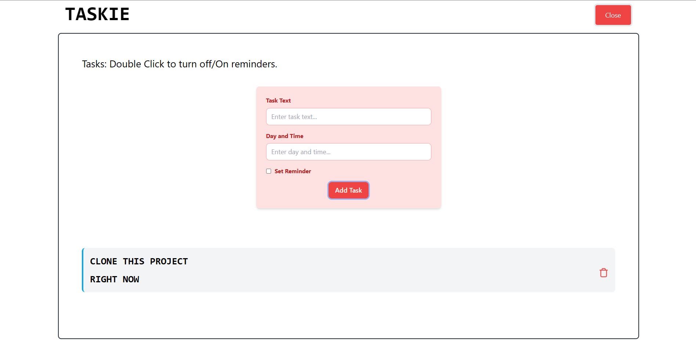

# Taskie



A simple Task Manager application built using Angular and Tailwind CSS. This app allows users to add, delete, and toggle reminders on tasks.

## Features

- Add tasks with a title and optional reminder
- Delete tasks
- Toggle reminder for tasks
- Responsive design with Tailwind CSS
- Angular components for easy management

## Installation

1. Clone the repository:

```git clone git@github.com:itse4elhaam/Taskie.git```

2. Navigate to the the folder

```cd ./Taskie```

3. Install the dependencies

```npm i```

4. Run the server locally

```ng serve```

# Technologies Used

    Angular: A powerful framework for building web applications.
    Tailwind CSS: A utility-first CSS framework for quickly styling your app.
    TypeScript: A superset of JavaScript, used to write Angular components.

# Directory Structure

    src/app/components: Contains the Angular components used in the app.
    src/app/services: Contains the services that handle data and app logic.

# Contributing

Contributions are welcome! If you find any issues or have suggestions, feel free to open an issue or create a pull request.

# License

This project is licensed under the MIT License.
